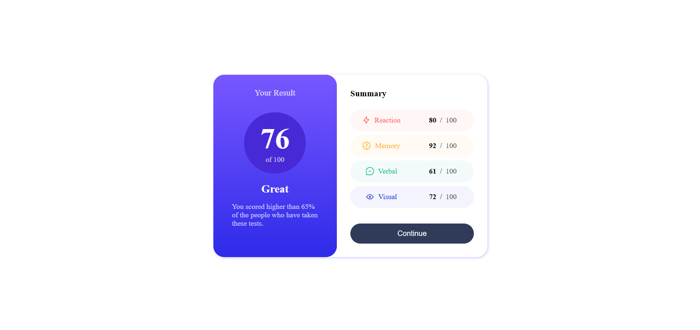

# Frontend Mentor - Results summary component solution

This is a solution to the [Results summary component challenge on Frontend Mentor](https://www.frontendmentor.io/challenges/results-summary-component-CE_K6s0maV). Frontend Mentor challenges help you improve your coding skills by building realistic projects. 

## Table of contents

- [Overview](#overview)
  - [Screenshot](#screenshot)
  - [Links](#links)
  - [Built with](#built-with)

## Overview

### Screenshot

### Links

- Solution URL: [https://github.com/un1c0rn-the-pwnie/Results-summary-component-solution](https://github.com/un1c0rn-the-pwnie/Results-summary-component-solution)

### Built with

- HTML5 & JavaScript
- CSS custom properties
- Flexbox
- Responsive Design
- Mobile-first workflow
- [React](https://reactjs.org/) - JS library
